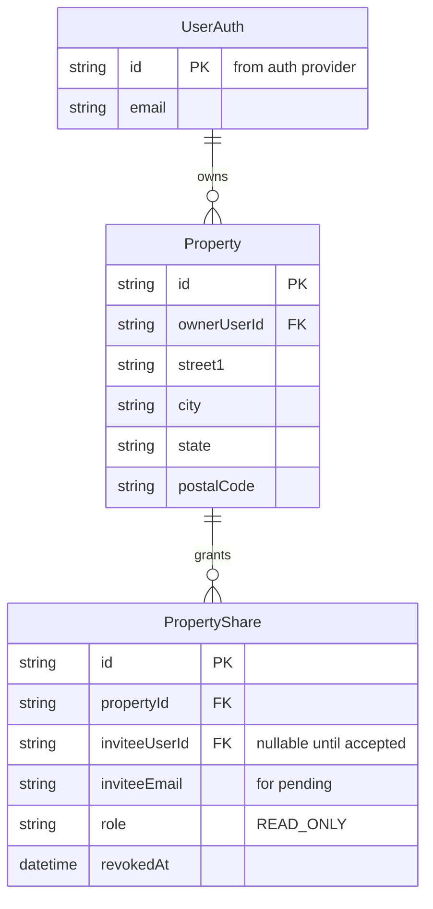

# User-scoped properties, authentication, and read-only sharing

## Overview

Introduce authenticated sessions, per-property ownership, and read-only sharing so dashboard and API access are no longer world-readable. Legacy production data is backfilled onto a single designated internal account. Public marketing routes (e.g. `/`) remain reachable without sign-in; all `/dashboard/**` app surfaces require a session.

**Origin document:** decisions and requirements R1–R6 are carried forward from [docs/brainstorms/2026-04-13-user-scoped-properties-auth-requirements.md](docs/brainstorms/2026-04-13-user-scoped-properties-auth-requirements.md) — cited below as `(see origin: …)`.

## Problem Statement / Motivation

Today, `Property` rows have no owner; `findMany` on the dashboard and `getPropertyDetail` / API handlers do not filter by user `(see origin: docs/brainstorms/2026-04-13-user-scoped-properties-auth-requirements.md)`. That violates privacy expectations for a buyer tool and fails basic authorization. The change must apply consistently to **pages**, **Route Handlers**, and any future Server Actions so IDOR is not reintroduced.

## Proposed Solution

### High level

1. **Identity**: Integrate a hosted auth solution that provides stable user ids, session management, and sign-in/sign-up UI suitable for Next.js App Router (exact vendor TBD; selection criteria below).
2. **Data model**: Add `ownerUserId` on `Property` (required after migration). Add a `PropertyShare` (or equivalent) table: property id, invitee user id (after acceptance) and/or pending invite keyed by email, role `READ_ONLY`, timestamps, optional revocation `(see origin: R5, R2)`.
3. **Authorization helpers**: Central functions, e.g. “can this user read/write property X?” — used by dashboard loaders, `getPropertyDetail`, and every API route that touches property-scoped data.
4. **Route protection**: Unauthenticated users hitting `/dashboard` or deep links redirect to sign-in `(see origin: R1)`. Authenticated users without access get **403** or a deliberate **404** policy (document the anti-enumeration choice).
5. **Legacy migration**: One-time migration sets `ownerUserId` for all existing rows to a configured internal user id `(see origin: R4)`. That account should be **not** used for normal end-user login in production (env-guarded or login-disabled) to avoid accidental “super-admin” UX.
6. **Sharing UX**: Owner invites by email; invitee must sign up / sign in; on acceptance, link `PropertyShare` to resolved user id `(see origin: R5)`. Dashboard shows owned properties and a distinct “Shared with you” section `(see origin: deferred UX — layout detail in implementation)`.
7. **Dedupe rule change**: Today `upsertProperty` dedupes globally on address fields `lib/domain/property.ts`. With ownership, uniqueness should be **scoped per owner** (composite uniqueness on owner + address components) so two users evaluating the same address do not collide `(see origin: R2)` — document and migrate carefully.

### Implementation phases (suggested order)

| Phase | Focus | Deliverables |
|-------|--------|--------------|
| **1** | Auth foundation | Provider wired; session available in server components and Route Handlers; sign-in/out routes; middleware or layout protection for `/dashboard` |
| **2** | Schema + migration | `ownerUserId`, indexes; `PropertyShare` model; backfill legacy to internal id; Prisma migrate |
| **3** | Authorization layer | `assertPropertyRead` / `assertPropertyWrite`; refactor `getPropertyDetail`, `upsertProperty`, dashboard queries, compare page |
| **4** | API hardening | `POST /api/properties/upsert`, `GET /api/properties/[id]`, uploads, preanalyze, ingestion job GET — all enforce auth + ACL; document 401/403 behavior |
| **5** | Sharing | Invite create/list/revoke API + minimal UI; acceptance ties invite email to signed-in user per provider rules |
| **6** | QA | Integration tests or E2E for IDOR, revoke, compare with mixed access |

## Technical Considerations

- **Stack**: Next.js `^15.1.0`, React 19, Prisma `^6.1.0`, PostgreSQL, Vitest `(see repo: package.json)`.
- **No middleware today**: `middleware.ts` is absent — add route protection consistent with Next.js 15 docs (middleware and/or protected layout + server-side checks). **Defense in depth**: never rely on client-side gating alone.
- **Security**: Treat all `propertyId` inputs as untrusted. Return **403** vs **404** consistently to reduce enumeration leakage; align page and JSON API behavior `(see SpecFlow #1)`.
- **Internal job route**: `POST /api/ingestion/jobs/[id]/process` is secret-gated — ensure job’s `propertyId` still aligns with tenant expectations if ingestion is refactored `(see SpecFlow #20)`.
- **Caching**: Dashboard and property pages use `force-dynamic` today on at least one page — verify no static caching leaks authenticated content `(see SpecFlow #21)`.
- **Auth provider selection criteria** `(see origin: deferred)` — prioritize: stable `userId`, email for invites, official Next.js App Router support, middleware compatibility, Vercel env integration. **Clerk** is a common fit for this stack; final choice is implementation detail but should be recorded in PR / env docs.

## System-Wide Impact

- **Interaction graph**: Sign-in → session cookie → middleware/layout → RSC loaders (`app/dashboard/**`) → `prisma.property.findMany` with new `where` / joins → `getPropertyDetail` → child components. Client forms call `/api/properties/*` → same ACL as server.
- **Error propagation**: API returns JSON errors; ensure upload/preanalyze surfaces **401/403** clearly in UI (not generic 500).
- **State lifecycle**: Migration must be idempotent; partial failure should not leave half of properties ownerless `(see SpecFlow #13–15)`.
- **API surface parity**: Any code path that reads `Property` by id (including `lib/scoring/recompute-profile.ts` invoked from uploads) must only run after write authorization on the parent property.
- **Integration test scenarios** (non-exhaustive):
  - User A cannot `GET`/`POST` User B’s property id (curl).
  - Share revoked → invitee loses access on next request `(see SpecFlow #3)`.
  - Read-only sharee: `GET` detail OK; `POST` upload/preanalyze **403**.
  - Compare page with two authorized ids vs one unauthorized id.
  - Sign-out → back/forward does not show cached dashboard `(see SpecFlow #22)`.

## Data model sketch (implementation detail — ERD)

Exact column names and whether pending invites use a separate table vs nullable fields are **deferred to implementation**; constraints must enforce one active share per (property, invitee) if that is the product rule.

## SpecFlow highlights (gaps & edge cases)

Incorporated from structured analysis — acceptance planning should cover:

- **403 vs 404** for cross-tenant id guessing; no address/score leakage in JSON `(see SpecFlow #1)`.
- **Internal account**: login-disabled or env-only to avoid accidental super-admin `(see SpecFlow #2)`.
- **Invite identity**: OAuth vs email mismatch when accepting invite `(see SpecFlow #4)`.
- **Duplicate invites** idempotent UX `(see SpecFlow #5)`.
- **Read-only** applies to all nested reads; mutations blocked at API `(see SpecFlow #6, #18)`.
- **Compare** with mixed authorization `(see SpecFlow #7)`.
- **Dedupe**: per-owner address uniqueness `(see SpecFlow #14)` and collision with internal account `(see SpecFlow #15)`.
- **Delete property** cascades shares; invitee list updates `(see SpecFlow #16)`.
- **Empty state**: only shared properties, no owned `(see SpecFlow #24)`.

## Acceptance Criteria

### Functional

- [ ] Unauthenticated requests to `/dashboard`, `/dashboard/compare`, and `/dashboard/properties/[id]` redirect to sign-in (or render sign-in), not property data `(see origin: R1)`.
- [ ] Authenticated user sees only properties they **own** or **shared read-only** `(see origin: R3, R5)`.
- [ ] `POST /api/properties/upsert` creates property with `ownerUserId` = current user; rejects unauthenticated requests `(see origin: R2)`.
- [ ] `GET /api/properties/[id]` returns 401/403/404 per policy when user lacks access `(see origin: R3)`.
- [ ] Upload and preanalyze endpoints require **write** access (owner only); sharees get **403** `(see origin: R5)`.
- [ ] Legacy migration: all pre-existing properties have `ownerUserId` = configured internal id; migration is repeatable or clearly one-shot documented `(see origin: R4)`.
- [ ] Owner can invite by email; invitee after sign-in sees property under “Shared with you” (or equivalent clear labeling) `(see origin: R5)`.
- [ ] Revoked or invalid share cannot access property `(see origin: success criteria)`.

### Non-functional

- [ ] No IDOR: property ids from other tenants are not readable via API or page `(see origin: success criteria)`.
- [ ] Automated tests cover at least one unauthorized API path and one read-only share path (Vitest integration or E2E as appropriate).

## Success Metrics

- Manual or automated verification passes for cross-user access denial `(see origin: Success Criteria)`.
- No production incident of “all users see all properties” after deploy (monitoring + smoke test).

## Dependencies & Risks

| Dependency / risk | Mitigation |
|---------------------|------------|
| Auth vendor onboarding (DNS, keys, Vercel env) | Document env vars; use preview deployments |
| Migration on live DB | Backup; test on staging; idempotent script |
| Invite email delivery | Use provider email or Resend later; v1 can be minimal |
| Address dedupe semantics change | Explicit migration note; communicate composite unique |

## Documentation plan

- Update `README.md` (local dev: auth env, test users).
- Optional: `AGENTS.md` or project doc for `INTERNAL_LEGACY_USER_ID` (or equivalent).

## Sources & References

- **Origin document:** [docs/brainstorms/2026-04-13-user-scoped-properties-auth-requirements.md](docs/brainstorms/2026-04-13-user-scoped-properties-auth-requirements.md) — key decisions: dashboard auth gate; legacy → internal account; read-only share with sign-in; no magic-link public viewing in v1.
- **Repo touchpoints:** `app/dashboard/page.tsx`, `app/dashboard/compare/page.tsx`, `app/dashboard/properties/[propertyId]/page.tsx`, `app/api/properties/upsert/route.ts`, `app/api/properties/[id]/route.ts`, `app/api/properties/[id]/uploads/route.ts`, `app/api/properties/[id]/preanalyze/route.ts`, `app/api/ingestion/jobs/[id]/route.ts`, `lib/domain/property.ts`, `prisma/schema.prisma`.
- **External:** [Next.js Authentication](https://nextjs.org/docs/app/building-your-application/authentication) — patterns for session + protected routes (verify against installed Next minor version).

## Pre-submission checklist (plan author)

- [x] Origin document cross-check: R1–R6, success criteria, scope boundaries reflected
- [x] Open questions from origin “Deferred to Planning” addressed as planning tasks (provider, migration, invites, UX layout)
- [x] SpecFlow edge cases folded into acceptance and system-wide impact
